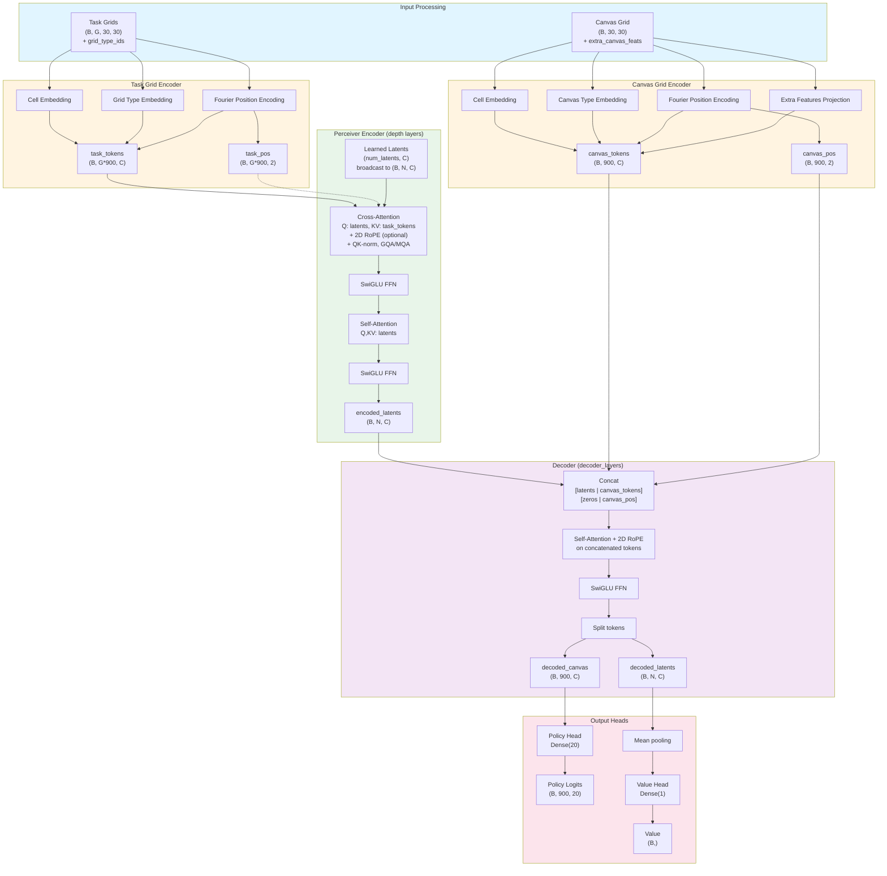

# ARC-AGI PPO Training Architecture Overview

This document describes the architecture of the Perceiver-based actor-critic model and the PPO training loop used for ARC-AGI tasks.

---

## 1. Model Architecture: Perceiver Actor-Critic

The model consists of grid encoders, a Perceiver encoder with cross-attention to task demonstrations, a decoder that processes both latent and canvas tokens, and separate policy/value heads.

### High-Level Flow



### Key Components

**Grid Encoders** (`GridEncoder` class):
- Embed cell values (including EMPTY_CELL=-1 → index 0)
- Embed grid type IDs (input/output/canvas distinction)
- Generate Fourier position encodings for 2D coordinates
- Fuse canvas extras (cursor mask, last action, selected color, time remaining) before tokenization
- Patchify 3×3 regions with a linear projection → 10×10 tokens per grid instead of 30×30
- Output: patch tokens + patch-center coordinates for RoPE

**Perceiver Encoder** (`PerceiverEncoderBlock` × depth):
1. **Cross-Attention**: Latents query task demonstration tokens
   - Optional 2D RoPE on key positions
   - QK-normalization for training stability
   - GQA/MQA via KV head repetition
2. **FFN**: SwiGLU activation with dropout
3. **Self-Attention**: Latents attend to each other
4. **FFN**: Second feed-forward block

**Decoder** (`DecoderBlock` × decoder_layers):
- Concatenates encoded latents with canvas patch tokens and an explicit cursor token
- Self-attention over combined sequence with 2D RoPE
- Processes spatial relationships in canvas

**Output Heads**:
- **Policy**: Dense layer over cursor token only → `(B, 20)` logits
- **Value**: Mean-pool latent tokens → Dense → scalar value estimate

**Action Selection**:
- Decoder emits cursor-token logits directly; sample from categorical distribution for both training and evaluation

---

## 2. PPO Training Loop

The training loop manages rollout collection with cached task encodings, GAE computation, and multi-epoch minibatch optimization.

### Training Flow Diagram

```mermaid
flowchart TD
    Start([Start Training]) --> Init["Initialize:<br/>- ARCEnv<br/>- PerceiverActorCritic<br/>- Optimizer (Adam + grad clip)<br/>- Reset batch of envs"]
    
    Init --> UpdateLoop{{"For each update<br/>(1..total_updates)"}}
    
    UpdateLoop --> BuildCtx["Build Task Context:<br/>env.build_context_batch(problem_idx)<br/>→ task_grids, grid_ids, mask"]
    
    BuildCtx --> Cache["Cache Task Encoding:<br/>task_cache_fn(params, problem_idx)<br/>→ TaskCache(latents, mask)"]
    
    Cache --> Rollout["Rollout Collection<br/>(rollout_length steps)"]
    
    subgraph RolloutPhase["Rollout Phase (deterministic=True)"]
        Rollout --> R1["Build extra_canvas_feats:<br/>cursor, last_action,<br/>selected_color, time"]
        R1 --> R2["Model forward:<br/>policy_step(params, state, cache)<br/>→ cursor logits, values"]
        R2 --> R3["Cursor-token logits already (B, 20)"]
        R3 --> R4["Sample actions:<br/>categorical(log_probs)"]
        R4 --> R5["Environment step:<br/>env_step_batch(state, actions)<br/>→ next_state, rewards, dones"]
        R5 --> R6["Record transition:<br/>canvas, cursor, actions,<br/>log_probs, values, rewards, dones"]
        R6 --> R7{More steps?}
        R7 -->|Yes| R1
        R7 -->|No| R8["Cache next task encoding<br/>Compute last_value"]
    end
    
    R8 --> GAE["Compute GAE:<br/>advantages, returns = compute_gae(<br/>  rewards, values, dones, last_value,<br/>  gamma, gae_lambda)<br/>Normalize advantages"]
    
    GAE --> Update["PPO Update"]
    
    subgraph UpdatePhase["Update Phase (deterministic=False)"]
        Update --> U1{{"For each epoch<br/>(1..num_epochs)"}}
        U1 --> U2["Shuffle timesteps"]
        U2 --> U3{{"For each minibatch<br/>(1..num_minibatches)"}}
        U3 --> U4["Get minibatch slice<br/>(steps_per_minibatch timesteps)"]
        U4 --> U5["Model forward:<br/>build extra_feats + apply<br/>→ new_log_probs, new_values"]
        U5 --> U6["Compute PPO loss:<br/>- Policy: clip(ratio, 1±ε) × advantages<br/>- Value: 0.5 × (values - returns)²<br/>- Entropy: -Σ p log p<br/>loss = policy + value_coef×value - entropy_coef×entropy"]
        U6 --> U7["Backprop + clip gradients<br/>Apply optimizer step"]
        U7 --> U8{More minibatches?}
        U8 -->|Yes| U3
        U8 -->|No| U9{More epochs?}
        U9 -->|Yes| U2
        U9 -->|No| UpdateDone["Update complete"]
    end
    
    UpdateDone --> Reset["Reset done environments:<br/>reset_done_envs(next_state, rng)"]
    
    Reset --> Log{Log interval?}
    Log -->|Yes| LogMetrics["Log metrics:<br/>return, loss, policy_loss,<br/>value_loss, entropy, kl,<br/>done_rate, success_rate, etc."]
    Log -->|No| Eval
    LogMetrics --> Eval
    
    Eval{Eval interval?}
    Eval -->|Yes| EvalRun["Run evaluation:<br/>- Reset eval envs<br/>- Greedy rollout (eval_horizon)<br/>- Compute metrics (train/test)"]
    EvalRun --> Ckpt
    Eval -->|No| Ckpt
    
    Ckpt{Checkpoint interval?}
    Ckpt -->|Yes| Save["Save checkpoint:<br/>save_checkpoint(train_state, step)"]
    Ckpt -->|No| Continue
    Save --> Continue
    
    Continue{More updates?}
    Continue -->|Yes| UpdateLoop
    Continue -->|No| FinalSave["Final checkpoint save"]
    
    FinalSave --> End([End Training])
    
    style RolloutPhase fill:#e8f5e9
    style UpdatePhase fill:#fff3e0
    style Start fill:#e1f5ff
    style End fill:#e1f5ff
```



### Detailed Training Sequence

```mermaid
sequenceDiagram
    autonumber
    participant Main as Main Loop
    participant Env as ARCEnv
    participant Cache as task_cache_fn
    participant Model as PerceiverActorCritic
    participant Value as value_fn
    participant PPO as ppo_update_fn
    participant Opt as Optimizer

    Note over Main,Opt: Initialization
    Main->>Env: env_reset_batch(batch_size=num_envs, train=True)
    Env-->>Main: state₀ (canvas, cursor, inp, target, problem_idx, ...)

    Note over Main,Opt: Update Loop (repeat total_updates times)
    
    rect rgb(232, 245, 233)
        Note over Main,Model: ROLLOUT PHASE (deterministic=True)
        Main->>Env: build_context_batch(state.problem_idx)
        Env-->>Main: task_grids, grid_ids, token_mask
        Main->>Cache: cache_fn(params, state.problem_idx)
        Note right of Cache: Calls model.prepare_task_latents<br/>Encodes demos once into latent slots
        Cache-->>Main: TaskCache(tokens, pos, mask)
        
        loop For t=1 to rollout_length
            Main->>Main: build_extra_canvas_features(<br/>  cursor, last_action,<br/>  selected_color, steps)
            Main->>Model: apply(params, cache, state.canvas,<br/>  extra_feats, deterministic=True)
            Model-->>Main: {logits: (B,900,20), value: (B,)}
            Main->>Main: cursor logits already match action space (B,20)
            Main->>Main: sample actions ~ categorical(log_probs)
            Main->>Env: env_step_batch(state, actions)
            Env-->>Main: next_state, rewards, dones
            Main->>Main: store transition (canvas, cursor,<br/>  actions, log_probs, values,<br/>  rewards, dones)
            Main->>Main: state ← next_state
        end
        
        Main->>Cache: cache_fn(params, next_state.problem_idx)
        Cache-->>Main: next_cache
        Main->>Value: value_fn(params, next_state, next_cache)
        Value-->>Main: last_value
    end
    
    rect rgb(255, 243, 224)
        Note over Main,PPO: ADVANTAGE COMPUTATION
        Main->>Main: advantages, returns = compute_gae(<br/>  rewards, values, dones, last_value,<br/>  gamma, gae_lambda)
        Main->>Main: Normalize advantages:<br/>  (adv - mean) / (std + 1e-8)
        Main->>Main: Prepare batch dict:<br/>  canvas, cursor, last_action,<br/>  selected_color, steps, actions,<br/>  old_log_probs, advantages, returns
    end
    
    rect rgb(255, 243, 224)
        Note over Main,Opt: UPDATE PHASE (deterministic=False)
        loop For epoch=1 to num_epochs
            Main->>Main: Shuffle timestep indices
            loop For minibatch=1 to num_minibatches
                Main->>Main: Extract minibatch slice<br/>  (steps_per_minibatch timesteps)
                Main->>PPO: ppo_update_fn(train_state,<br/>  minibatch, rng, cache)
                
                loop For each timestep in minibatch
                    PPO->>PPO: build_extra_canvas_features(...)
                    PPO->>Model: apply(params, cache, canvas,<br/>  extra_feats, deterministic=False)
                    Note right of Model: Dropout enabled
                    Model-->>PPO: {logits, value}
                    PPO->>PPO: cursor-token logits → new_log_probs
                    PPO->>PPO: Compute ratios = exp(new - old)
                    PPO->>PPO: Policy loss = -min(<br/>  ratio × adv,<br/>  clip(ratio,1-ε,1+ε) × adv)
                    PPO->>PPO: Value loss = 0.5×(value - returns)²
                    PPO->>PPO: Entropy = -Σ p log p
                    PPO->>PPO: Total loss = policy_loss +<br/>  value_coef×value_loss -<br/>  entropy_coef×entropy
                end
                
                PPO->>PPO: Aggregate metrics over timesteps
                PPO->>PPO: Compute gradients
                PPO->>Opt: apply_gradients(grads)
                Note right of Opt: Includes grad clipping
                Opt-->>PPO: updated params
                PPO-->>Main: new_train_state, metrics
            end
        end
    end
    
    Main->>Env: reset_done_envs(next_state, rng)
    Note right of Env: Selectively resets envs where done=True
    Env-->>Main: state (with resets applied)
    
    alt Log interval
        Main->>Main: Log training metrics:<br/>  return, loss, policy_loss,<br/>  value_loss, entropy, approx_kl,<br/>  clip_fraction, done_rate,<br/>  success_rate, IoU, accuracy
        opt WandB enabled
            Main->>Main: wandb.log(metrics)
        end
    end
    
    alt Eval interval
        Main->>Env: env_reset_batch(eval_envs, train/test)
        Env-->>Main: eval_state
        Main->>Cache: cache_fn(params, eval_state.problem_idx)
        Cache-->>Main: eval_cache
        loop For step=1 to eval_horizon
            Main->>Model: policy_step_greedy(params, eval_state, eval_cache)
            Note right of Model: Argmax action selection
            Model-->>Main: actions, log_probs, values
            Main->>Env: env_step_batch(eval_state, actions)
            Env-->>Main: eval_state, rewards, dones
            alt All done
                Main->>Main: Break early
            end
        end
        Main->>Main: Compute eval metrics (train/test split)
        Main->>Main: Log eval metrics
        opt Checkpoint enabled
            Main->>Main: save_checkpoint(train_state, step)
        end
    end
    
    opt Checkpoint interval (independent)
        Main->>Main: save_checkpoint(train_state, step)
    end
```

### Key Design Decisions

**Task Encoding Cache**:
- `prepare_task_latents` encodes demonstration grids once per problem
- Cache is reused across all rollout steps and update iterations
- Avoids redundant computation (~90% of forward pass for multi-demo problems)

**Minibatch Strategy**:
- Minibatches are slices of **timesteps** (not environments)
- Each minibatch spans `steps_per_minibatch = rollout_length // num_minibatches` timesteps
- All `num_envs` environments share the same cache during a minibatch
- Constraint: `num_minibatches` must divide `rollout_length` evenly

**Deterministic Flag**:
- `deterministic=True` during rollout/value estimation (no dropout)
- `deterministic=False` during training (enables dropout for regularization)

**Action Space**:
- 20 actions: move (4), choose color (10), paint, flood-fill, crop, move-to-origin, send, copy
- Policy outputs 20 logits per canvas cell (900 cells = 30×30)
- At execution: gather logits at cursor position, sample from categorical distribution

**Reward Modes**:
- **Sparse** (default): reward only on "send" action (episode termination)
- **Dense**: reward = Δscore at every step (score = 0.2×IoU + valid_accuracy + full_match)

**Environment Reset**:
- `reset_done_envs` selectively resets environments where `done=True`
- Maintains continuous experience collection across update boundaries

---

## 3. Code Organization

```
nets/
├── PerceiverActorCritic.py   # Main model: GridEncoder, encoder/decoder blocks, policy/value heads
├── PerceiverIO.py             # Baseline Perceiver-IO reference implementation
└── transformer_utils.py       # Shared utilities: MultiHeadAttention, RMSNorm, SwiGLU, RoPE

scripts/
└── ppo_train.py              # Training loop: rollout, GAE, PPO update, eval, logging

env/
├── env.py                    # ARCEnv: reset, step, build_context_batch, reward computation
├── types.py                  # ARCEnvState dataclass
├── utils.py                  # Grid utilities: pad_to_30, compute_valid_mask, flood_fill, etc.
└── data_loader.py            # Load ARC JSON files into ARCEnv
```

---

## 4. Hyperparameters & Presets

**Default Config** (`PPOConfig` dataclass):
- `num_envs=8`, `rollout_length=32`, `total_updates=200`
- `learning_rate=3e-4`, `gamma=0.996`, `gae_lambda=0.95`
- `clip_epsilon=0.2`, `value_coef=0.5`, `entropy_coef=0.05`
- `num_minibatches=4`, `num_epochs=4`, `max_grad_norm=0.5`

**A100 Preset** (`--preset a100`):
- `num_envs=64`, `rollout_length=128`, `total_updates=5000`
- `learning_rate=1e-4`, `num_minibatches=16`, `num_epochs=2`
- `eval_envs=32`, `eval_horizon=256`, `eval_interval=100`

**Model Config** (`PerceiverActorCritic` defaults):
- `num_latents=16`, `latent_dim=128`, `depth=2`, `decoder_layers=2`
- `num_heads=2`, `num_kv_heads=2`, `head_dim=32`
- `ff_multiplier=2`, `dropout=0.0`, `token_dropout=0.0`
- `dtype=jnp.bfloat16`, `use_remat=False`

---

## 5. Training Metrics

**Rollout Metrics** (logged every `log_interval` updates):
- `return_mean/std/max`: Episode returns from rollout
- `loss`, `policy_loss`, `value_loss`: PPO loss components
- `entropy`, `approx_kl`, `clip_fraction`: Policy statistics
- `done_rate`, `success_rate`: Fraction of episodes finished/solved
- `mean_steps`, `mean_solution_steps`: Step counts
- `mean_iou`, `valid_accuracy`: Grid matching quality

**Eval Metrics** (logged every `eval_interval` updates):
- Train/test splits: `{train,test}_{return,done_rate,success_rate,mean_steps,mean_iou,valid_accuracy}`
- Greedy policy evaluation over `eval_horizon` steps

---

## 6. Usage Example

```bash
# Debug run (CPU, small config)
python scripts/ppo_train.py \
  --data-dir data/training_simple \
  --num-envs 4 \
  --rollout-length 16 \
  --total-updates 50 \
  --device cpu

# A100 preset with wandb logging
python scripts/ppo_train.py \
  --preset a100 \
  --data-dir data/training \
  --reward-mode dense \
  --wandb-project arc-agi-ppo \
  --wandb-entity myteam \
  --wandb-mode online \
  --wandb-tags "a100,dense-reward,perceiver" \
  --checkpoint-interval 500 \
  --device cuda
```

---

## 7. Performance Considerations

**Compilation**:
- All core functions (`env_step_batch`, `rollout`, `ppo_update_fn`) are JIT-compiled
- First call triggers compilation (~30-60s), subsequent calls are fast

**Memory**:
- Task cache reuse reduces memory footprint (no per-step demo re-encoding)
- BFloat16 dtype halves memory vs Float32
- Gradient checkpointing (`use_remat=True`) trades compute for memory

**Throughput**:
- A100 preset: ~8,000 env steps/sec (64 envs × 128 steps = 8,192 steps/update)
- Default preset: ~500 env steps/sec (8 envs × 32 steps = 256 steps/update)

**Device Selection**:
- `--device cpu|cuda|tpu|auto` or env var `ARC_JAX_DEVICE`
- Data loading uses CPU by default (via `jax.default_device(cpu)`)

---

## 8. References

- **Perceiver IO**: Jaegle et al., 2021 ([arXiv:2107.14795](https://arxiv.org/abs/2107.14795))
- **PPO**: Schulman et al., 2017 ([arXiv:1707.06347](https://arxiv.org/abs/1707.06347))
- **RoPE**: Su et al., 2021 ([arXiv:2104.09864](https://arxiv.org/abs/2104.09864))
- **ARC-AGI**: Chollet, 2019 ([arXiv:1911.01547](https://arxiv.org/abs/1911.01547))
